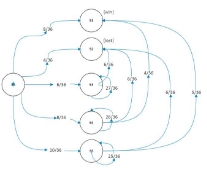
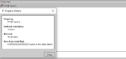
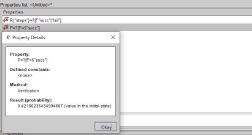
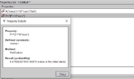

TP COPT

Propriétaire : [KHANFARA Hamza ](https://skfgroup.atlassian.net/wiki/people/712020:2d13ea1d-145e-46f9-9f5f-33a6a431133c?ref=confluence&src=profilecard)Il y a moins d'une minute

Jeu de Craps 

**1- Peut-on modéliser ce jeu par un DTMC? ** Oui, On peut modéliser ce jeu par un DTMC.

**2- Le diagramme de transitions de ce jeu : **

Diagramme de transitions

**3 - Modélisation à l’aide de logiciel PRISM **

1 dtmc 2

3

4  // Variable d'état du jeu
4  module jeu
4  s: [0..5] init 0;

7

8  // Lancer des dés (1 à 6)
8  [] s = 0 -> 8/36: (s' = 1) + 4/36: (s' = 2) + 6/36: (s' = 3) + 8/36: (s' = 4) + 10/36: (s' = 5);
8  [] s = 1 -> true; //succ
8  [] s = 2 -> true; //fail
8  [] s = 3 -> 3/36: (s' = 1) + 6/36: (s' = 2) + 27/36: (s' = 3); //4 ou 10
8  [] s = 4 -> 4/36: (s' = 1) + 6/36: (s' = 2) + 26/36: (s' = 4); //5 ou 9
8  [] s = 5 -> 5/36: (s' = 1) + 6/36: (s' = 2) + 25/36: (s' = 5); //6 ou 8

15

16 endmodule 17

18  label "start"=s=0;
18  label "succ"=s=1;
18  label "fail"=s=2;
18  label "continue"=s=3;

22

23

24  rewards "steps"
24  true:1;
24  endrewards

**4- La probabilité que le joueur gagne le jeu **

**4- La probabilité que le joueur perd le jeu ** Il faut vérifier la propriété suivante **P=?[F”fail”]**

**5- Le nombre moyen d'étape du jeu **

Il faut vérifier la propriété **R{“steps”} = ?[F”succ”|”fail”]**

**6- La probabilité que le joueur gagne en 5 étapes **

**6- La probabilité que le joueur gagne en 10 étapes **

